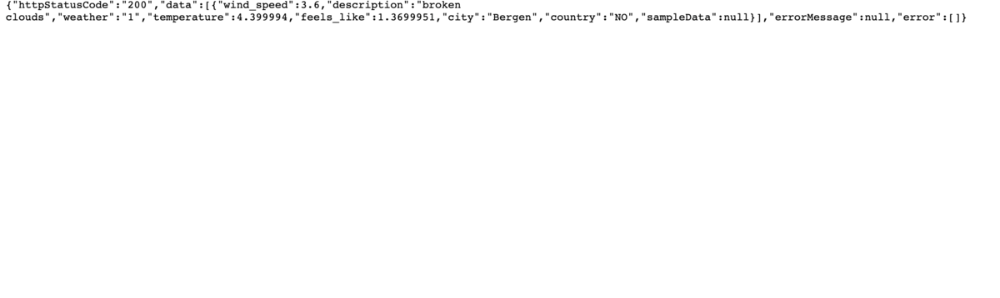

# Weather temperature aggregation system
System for storing and aggregation weather temperature

## System Services
- Open Api Weather Service
- Data-Flux Back End Service
- Redis Service
- Stream Sets service

## Service set up via docker-compose
- Update `open-weather.app.id` property in config with appropriate id
- Build Docker image
```bash
./gradlew clean build bootBuildImage
```
- Start system with docker compose
```bash
docker-compose -f docker-compose-full.yml up
```
- Open browser at `http:/localhost:18630` 
- Login here using `admin/admin` credentials
- Import pipeline from docs/stream-sets/sas-ta-weather-pipeline.json
- Install missed JDBC related libraries (just follow StreamSets' prompts)
- Install JDBC MySQL driver `package-manager --> external libraries --> jdbc driver`

## Service set up via docker-compose + IntelliJ
- Start system with docker compose
```bash
docker-compose -f docker-compose.yml up
```
- Open in browser at `http:/localhost:18630`
- Login with `admin/admin` credentials
- Import pipeline from `docs/stream-sets/sas-ta-weather-pipeline.json`
- Install missed JDBC related libraries (just follow StreamSets' prompts)
- Install JDBC MySQL driver `package-manager --> external libraries --> jdbc driver`
- Update `open-weather.app.id` property in config with appropriate id
- Start `flux-data` microservice with IntelliJ or
```bash
./gradlew clean build bootRun
```
## Pipeline Flow
Call to Open Api Weather Service ---> <br>
---> Map Response from Open Api Weather Service ---> <br> 
---> Call to Redis Service to verify if entity exists ---> <br>
---> Call to StreamSets appropriate endpoint to save entity ---> <br>
---> Show response from StreamSets in browser.

## Pipeline start:
- Open in browser `http:/localhost:18630`, select imported pipeline and press `Play` button
- Open in browser `http:/localhost:9999/start-stream` and check that data flow starts
<p align="left">
    
</p>


