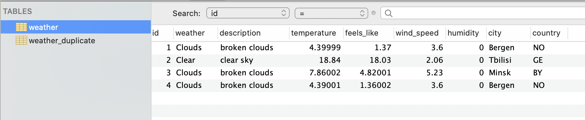
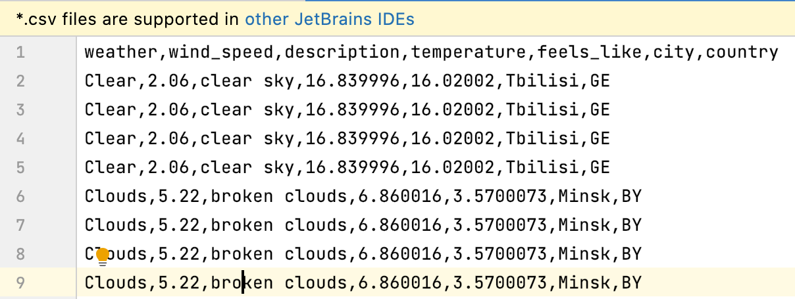
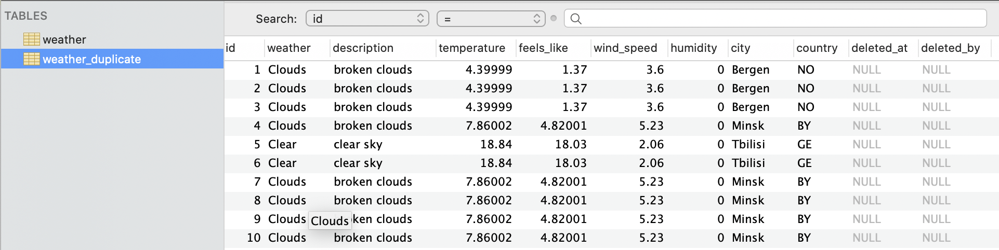
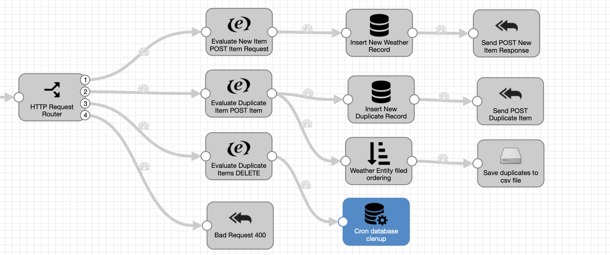

# TASK REPORT
### 1.Only the following fields have to be stored: wind_speed, description, weather, temperature, feels_like, humidity, city, country

    

### 2.Duplicates have to be stored in a separate CSV file on a local hard drive

    

### 3.All temperature values should be stored in Celsius

    

### 4.Duplicates have to be stored in separate table with soft delete flag

    

*deletedAt* and *deletedBy* fields used as flags for soft deletion, SQL query should be executed with/without filtering by this fields

### 5.Once a day the table have to be cleaned.

    

