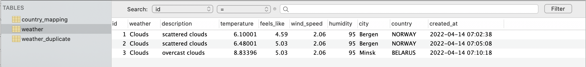
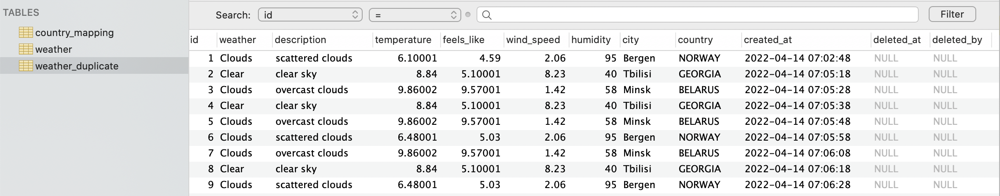

# TASK REPORT
## GENERAL REQUIREMENTS:
### 1. The BD screenshots
Main weather table:

    

Duplicates weather table:

    

Ivr table:

    

### 2. The CSV file screenshot with duplicates

    

### 3.Pipeline processing
Stream-Sets record processing

    

Stream-Sets API response after record processing

    

### 4.The access to pipeline json(s)
[Pipeline Json with Response](https://github.com/klindziukp/sas-data/blob/master/docs/stream-sets/sas-ta-weather-pipeline.json)  
[Pipeline Json with DB Mapping](https://github.com/klindziukp/sas-data/blob/master/docs/stream-sets/sas-ta-weather-pipeline-with-cm.json)

## ADDITIONAL REQUIREMENTS:
### 1.Only the following fields have to be stored: wind_speed, description, weather, temperature, feels_like, humidity, city, country

    

### 2.Duplicates have to be stored in a separate CSV file on a local hard drive

    

### 3.All temperature values should be stored in Celsius

    

    

### 4.Duplicates have to be stored in separate table with soft delete flag

    

__deletedAt__ and __deletedBy__ fields used as flags for soft deletion, SQL query should be executed with/without filtering by this fields

### 5.Once a day the table have to be cleaned.

    

### 6.The country name has to be in full name. The additional column with IVR code has to be added

    

    

    

